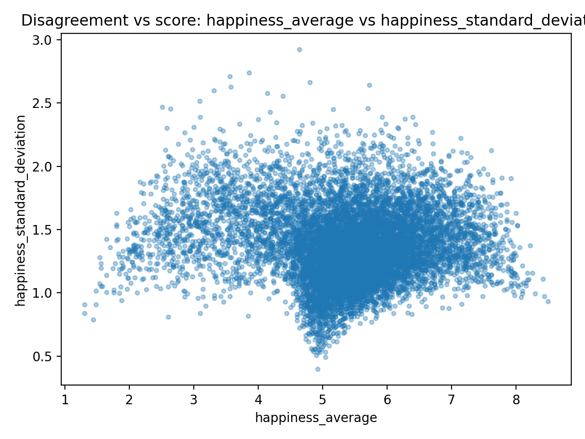
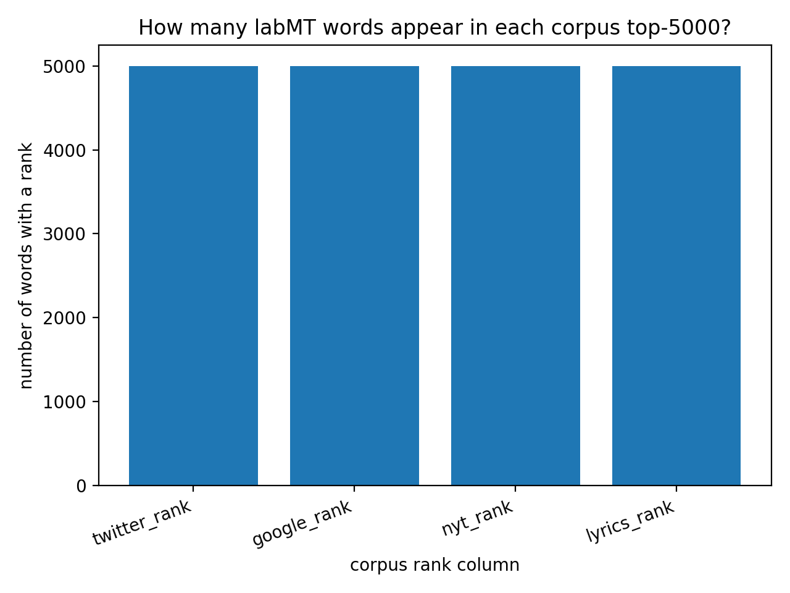
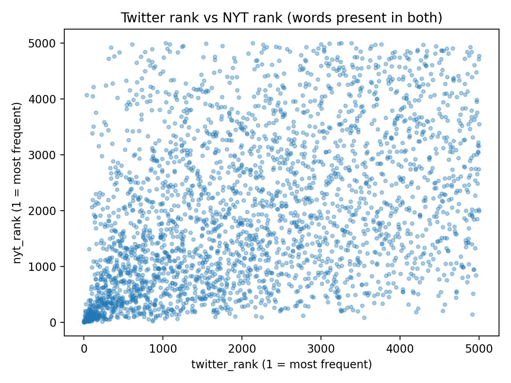

# Seminars 3 & 4 — Hedonometer (Project Folder)

This folder provides an **example project structure** (and an instructor/demo script) for the Seminars 3 & 4 group project using the **labMT 1.0** dataset (Data Set S1 from the Hedonometer paper).

It includes:
- the labMT 1.0 dataset file (`data/raw/Data_Set_S1.txt`)
- a runnable demo analysis script (`src/hedonometer_labmt_demo.py`) that produces a *typical* set of outputs aligned to the assignment
- course documents in `docs/` (original paper + paper companion + assignment + project quickstart), provided as **.pdf**

## Folder layout (course convention)

- `src/` — Python scripts you run
- `data/raw/` — input data (treat as read-only)
- `figures/` — PNG plots (embed these in your GitHub README)
- `tables/` — CSV tables/summaries (optional to embed, but useful for analysis)
- `docs/` — assignment + paper companion + quickstart handout

## Setup + run (from the project root)

### 1) Create a virtual environment

**macOS / Linux**
```bash
python3 -m venv .venv
source .venv/bin/activate
python3 -m pip install --upgrade pip
```

**Windows (PowerShell)**
```powershell
py -m venv .venv
.\.venv\Scripts\Activate.ps1
py -m pip install --upgrade pip
```

### 2) Install dependencies
```bash
python3 -m pip install -r requirements.txt
```

### 3) Run the demo analysis
```bash
python3 src/run_analysis.py
```

### What gets generated?
After running, look in:
- `figures/` — PNG plots
- `tables/` — CSV summary tables

# Hedonometer Project – Group 14

## 1. Overview

This project explores the labMT 1.0 dataset (“Language Assessment by Mechanical Turk”), 
which was used to construct a large-scale “hedonometer” for measuring happiness in text. 
We analyze the statistical properties of the dataset, examine patterns of disagreement, 
compare corpus rankings, and reflect critically on how the dataset was generated and what it can (and cannot) measure.

---

## 2. Dataset

### Source


### Data Dictionary

- **word** (text) — The English word being evaluated in the labMT dataset.  
  *Missingness:* No missing values.

- **happiness_rank** (integer) — Rank order of the word based on its average happiness score (1 = highest happiness).  
  *Missingness:* No missing values.

- **happiness_average** (float) — Mean happiness rating assigned by Mechanical Turk annotators on a 1–9 scale.  
  *Missingness:* No missing values.

- **happiness_standard_deviation** (float) — Standard deviation of happiness ratings across annotators, indicating the level of agreement or disagreement.  
  *Missingness:* No missing values.

- **twitter_rank** (float) — Frequency rank of the word in the Twitter corpus (restricted to the top 5000 most frequent words).  
  *Missingness:* 5,222 values are missing. A `NaN` value indicates the word does not appear in Twitter’s top-5000 list.

- **google_rank** (float) — Frequency rank in the Google Books corpus (top 5000 words).  
  *Missingness:* 5,222 values are missing. A `NaN` value indicates the word does not appear in Google Books’ top-5000 list.

- **nyt_rank** (float) — Frequency rank in the New York Times corpus (top 5000 words).  
  *Missingness:* 5,222 values are missing. A `NaN` value indicates the word does not appear in the NYT top-5000 list.

- **lyrics_rank** (float) — Frequency rank in the song lyrics corpus (top 5000 words).  
  *Missingness:* 5,222 values are missing. A `NaN` value indicates the word does not appear in the lyrics top-5000 list.

### Sanity Checks
**1. Checking for duplicate words:**  
Each row is supposed to represent a distinct word, so duplicates would indicate
a problem in the source file or in the read‑in options. We found no repetitions.

**2. Inspecting a random sample:**  
Picking 15 random rows lets you quickly spot formatting errors, data-type problems, missing values, and encoding issues without inspecting the entire dataset.

**3. Extreme value check: Ten most positive / ten most negative words:**  
Sorting by happiness score and examining the top and bottom 10 words verifies that numeric values are in the expected range and that the scores make intuitive sense (positive words score high, negative words score low). The data makes sense - most positive words such as laughter, happiness and love and most negative words such as died, kill or killed align with the expected data.

---

## 3. Methods

-Loading and Cleaning:

We loaded the labMT 1.0 dataset into a pandas DataFrame using pd.read_csv with tab (\t) as the delimiter. Because the file begins with metadata lines, we skipped the first three lines (skiprows=3). We also treated "--" as missing values (NaN) and converted numeric columns to appropriate numeric types to enable statistical analysis.

The dataset contains 10,222 rows and 8 columns.

A missing rank ("--") indicates that the word does not appear in the top-5000 list of that particular corpus, rather than representing corrupted or unknown data.

We used Python (pandas and matplotlib) to:


All code is available in the `src/` folder.

We conducted three main quantitative analyses:

1. Distribution analysis of happiness scores
2. Identification of contested words based on rating disagreement
3. Comparison of word frequency across four corpora (Twitter, Google Books, NYT, Lyrics)

The code calculates summary statistics, generates visualizations, and outputs tables for further interpretation.

---

## 4. Results

### 4.1 Distribution of Happiness Scores


**Interpretation:**  
The distribution of happiness scores follows a normal trend centered between 5.0 and 6.0, which demonstrates most words from corpus reflects netural and positive. The skew to the right reflects neutral and positive words outnumber negative ones, showing the nature of human communication is more focus on positive parts. The overall is generated as fan-shaped,illustrating that the disagreement increases as words become emotionally extreme.

---

### 4.2 Disagreement and Contested Words



**Interpretation:**  
The word“fucking”often acts as an intensifier to convey strong emotion rather than direct malice. But in formal occiasion, it is viewed as  vulgar and impolite. Its SD of 2.92 is the highest in the set, indicating that participants could not reach a consensus on this word. Similarly, the word“fuckin”is also used in casual talk for emotional expression and bring people closer together, yet it is considered as a stereotype of low education levels as well. And the high SD of 2.74 also reflects people holding different opinions. Compared to the others, “fucked” is more indicative of self-deprecation or depression and its low mean of 3.56 confirms a general consensus that is negative and the high SD of 2.71 still reveals a lack of agreement on reasonable use. While some people apply it to express terriable circumstance, those who value etiquette still perceive it as a sign of rudeness. And the “pussy” has two different uses,the mean of 4.8 is near to neutral while the high SD of 2.66 captures its dispute. On one hand, it can express affection for cats as it can also symbolize weakness or even extreme misogyny. The last word “whiskey”has the highest mean of 5.72 showing the general opinion of likes but the SD of 2.64 reflects that it depends on peronal history with alcohol. For middle class or socialite, it represents as leisure and relaxation. Conversely, for those who encountered with alcoholism or environment of loss of control, the word is a signal for danger.

---

### 4.3 Corpus Comparison
## Coverage across corpora



This chart shows how many labMT words appear among the **top 5000 most frequent words** in each corpus: Twitter, Google Books, New York Times, and song lyrics.

The results indicate that nearly all labMT words appear in each corpus, suggesting that the lexicon mainly contains widely used English vocabulary.

## Rank comparison between corpora



The scatterplot compares the frequency ranks of words in **Twitter** and **NYT**. Words near the lower-left corner are frequent in both corpora, while words that far away from the diagonal show differences in usage between informal social media language and formal journalistic writing.

For example, slang expressions may appear frequently on Twitter but rarely in newspapers.

## Vocabulary overlap across corpora

To further examine corpus differences, we calculated how many words appear in different combinations of the four corpora.

[View overlap table](tables/corpus_overlap_patterns.csv)

The results show that **1816 words appear in all four corpora**, forming a shared core vocabulary across different types of text. At the same time, many words appear only in specific corpora. For example, **1486 words appear only in song lyrics**, while **1115 appear only in Google Books**, **1043 only in NYT**, and **952 only in Twitter**.

These patterns highlight how language varies across communication contexts. Social media platforms such as Twitter tend to include informal expressions and slang, while news articles and books use more formal vocabulary. Lyrics also display distinctive emotional and expressive language.

---

## 5. Qualitative Exhibit of Words

We selected 20 words across four categories:

- 5 highly positive: laughter, happiness, love, happy, laughed
- 5 highly negative: terrorist, suicide, rape, terrorism, murder
- 5 highly contested: fucking, fuckin, fucked, pussy, whiskey
- 5 weired or culturally loaded: churches, capitalism, mortality, porn, cigarette

**Interpretive Discussion:**  

-What meanings/contexts the words can have

1) highly positive
The contexts for these words are generally stable, but subtle differences still exist:

*laughter/laughtered:

Common contexts: happiness, social interaction, humor, relaxation. Contrasting contexts may include: mockery, sarcasm, cynical laughter (e.g., laughed at someone), where the emotion may not be purely positive.

*happiness/happy:

Common contexts: subjective emotional state, blessings, life satisfaction (e.g., happy for you, happy life). It can also be a "performative" expression: a positive display on social media (e.g., look happy online), which doesn't necessarily represent genuine feelings.

*love:

Common contexts: romantic love, familial/friendship, liking/loving (e.g., love you/love this song). It can also be an exaggerated colloquial/internet slang term: I love that! (strong liking but not necessarily deep emotion). It can also appear in complex contexts: love-hate relationship.

2) highly negative

These words often carry strong moral and emotional weight in their contexts, thus more likely to receive consistently negative ratings:

*terrorist / terrorism:

Common contexts: news, politics, war, public safety (media reporting).

May also appear in controversial contexts: labeling, political language (whoever is called a "terrorist" often has a stance).

*suicide:

Common contexts: mental health, tragedy, crisis (mental health discussions, prevention).

Sometimes used lightly in online or subcultures (figurative expressions), but generally still strongly negative.

*rape:

Common contexts: crime, trauma, law and social movements (legal context, survivor narratives).

May also appear in metaphors or vulgar jokes (very sensitive, offensive), affecting reactions from different groups.

*murder:

Common contexts: crime news, justice, violence narratives (crime reporting). There are also slight "exaggerated uses": This workload is murdering me (figurative exaggeration), but the word itself is still strongly negative.

3) highly contested

This group best exemplifies the principle of "context determines emotion":

*fucking / fuckin / fucked: fucking / fucking / fucking done for:

Context A: attack, anger, insult (strongly negative).

Context B: emphasis/admiration/filler phrase (That's fucking amazing) may actually be positive or neutral.

"Fucked" is also often used to express "terrible/done for": I'm fucked (negative), but it can also be used jokingly among friends.

*pussy: 

Contextual differences are greater:
Children's terminology (cat)

Sexual connotations (neutral/intimate/adult video context)

Insulting usage (gender-shaming, negative and offensive)

Different groups have very different judgments about the degree of offense.

*whiskey: Whiskey

Context A: Celebration, social interaction, drinking culture (positive/neutral).

Context B: Addiction, health risks, the pain of alcoholism (negative).

Therefore, some people find it "enjoyable," while others associate it with "harm."

4) weird / culturally Loaded: 

The context of this group is often strongly correlated with identity, values, and historical background:

*churches: religious beliefs/community belonging vs. experiences of oppression/criticism of religious institutions (significant differences across backgrounds).

*capitalism: for some, it's opportunity and a free market; for others, it's exploitation and inequality (strong influence of political stance).

*mortality: philosophical, medical, and death-related topics; relatively neutral in academic contexts, but potentially heavy in personal experiences.

*porn: sexual openness/entertainment industry vs. moral controversies/exploitation discussions/religious taboos (vast cultural differences).

*cigarette: nostalgia, film/social symbol vs. health risks, addiction, public smoking bans (significant changes over time).

-Why an happiness score might be high/low

The happiness scores of words often reflect the kinds of experiences and associations people connect with them. Words such as laughter, happiness, and love tend to receive high scores because they are closely associated with positive emotions, social bonding, and enjoyable experiences. In contrast, words such as terrorist, suicide, and murder refer to violence, tragedy, or moral harm, which typically evoke strong negative emotional responses and therefore receive low scores. Some words produce more varied reactions depending on context. Profanity such as fucking or fucked can function as insults in some situations but as emphasis or excitement in others, which affects how people perceive their emotional tone. Similarly, culturally loaded words like capitalism, churches, or cigarette may evoke different feelings depending on a person’s beliefs, experiences, or cultural background. As a result, happiness scores capture an overall average of these diverse interpretations.

-What kinds of voices or communities might use it differently

Different communities may use and interpret these words differently depending on their cultural background, social norms, and experiences. For example, profanity such as fucking or fuckin is often used casually in online communities or among younger speakers, where it may function as humor or emphasis rather than as an insult. In contrast, older generations or more formal social contexts may view such language as inappropriate or offensive. Similarly, words like capitalism or churches can carry very different meanings depending on political or religious communities: some may associate them with freedom, faith, and community, while others may connect them with inequality or institutional power. Even everyday words like cigarette or whiskey may evoke nostalgia and social rituals for some groups, but concerns about addiction and health risks for others. These differences show that emotional interpretations of words are shaped by the communities and contexts in which they are used.
---

## 6. Critical Reflection

### 6.1 Data Generation Pipeline

(Describe the steps used to construct the dataset.)

### 6.2 Consequences and Limitations

(Discuss at least five design choices and their implications.)

### 6.3 Instrument Note

(200–400 word reflection.)

---

## 7. How to Run This Project

1. Clone the repository:

2. Install required packages:

3. Run the main scripts:


---

## 8. Credits

- Person 1 – Workflow lead & data cleaning
- Person 2 – Quantitative analysis ()
- Person 3 – Quantitative analysis ()
- Person 4 – Qualitative exhibit
- Person 5 – Critical reflection

### Citation

