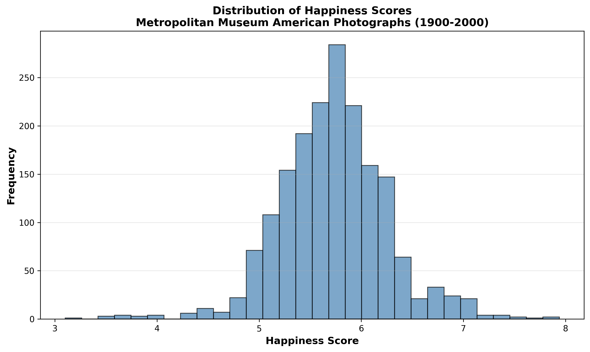
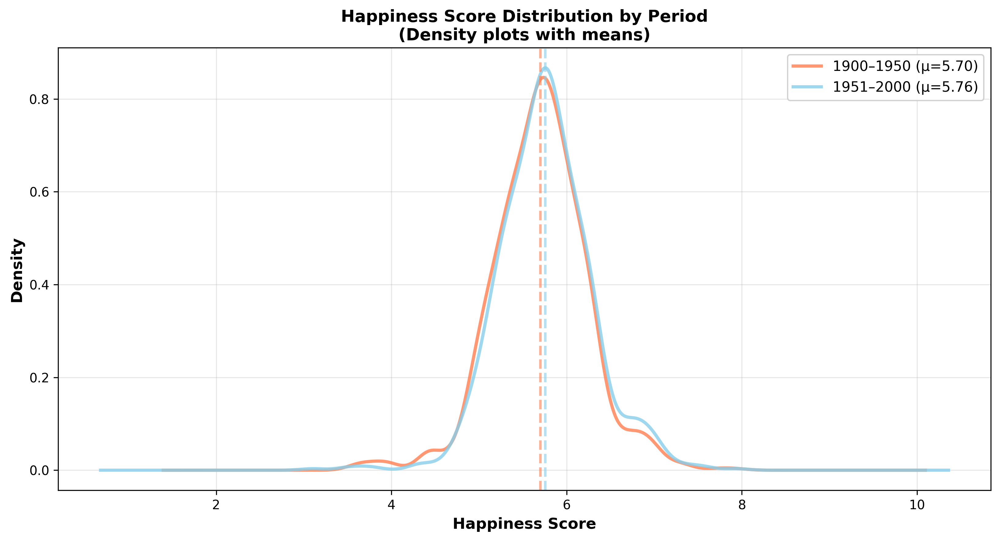
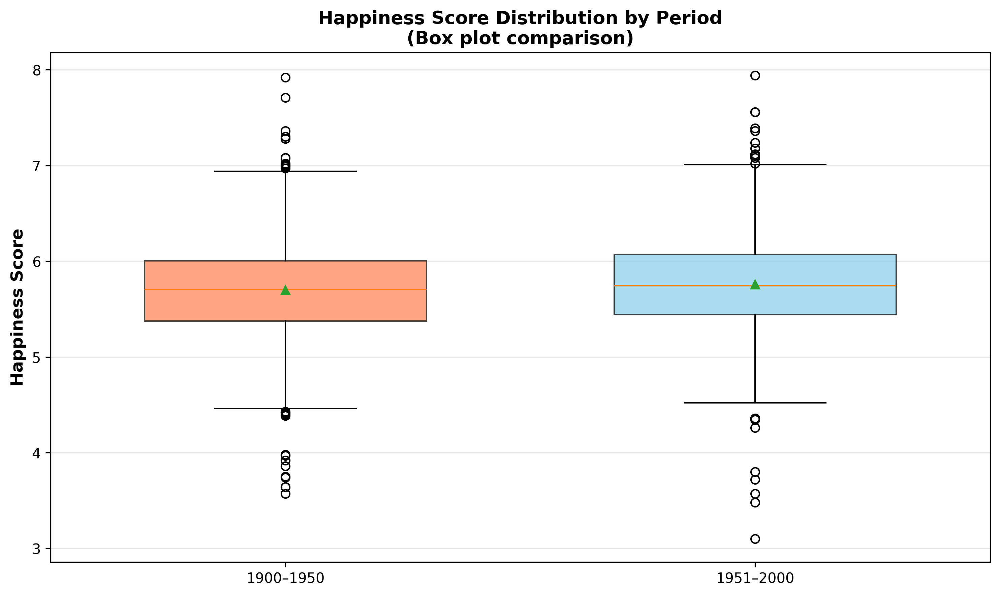
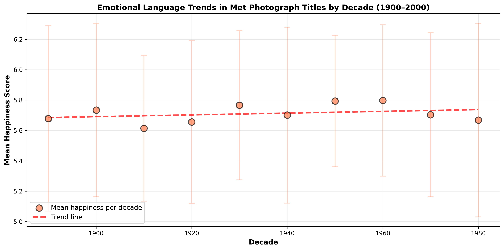
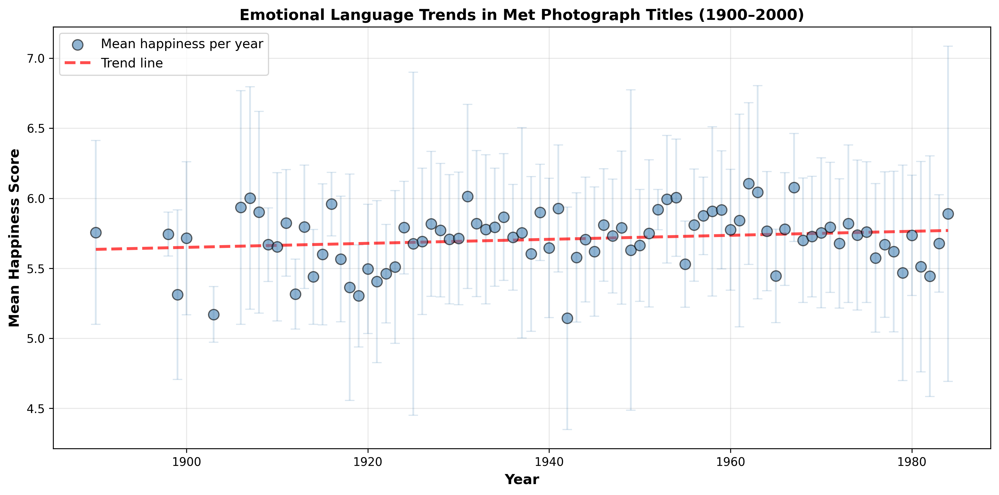

# Hedonometer Project – Group 14

# Assignment 1

## 1. Overview

This project explores the labMT 1.0 dataset (“Language Assessment by Mechanical Turk”), 
which was used to construct a large-scale “hedonometer” for measuring happiness in text. 
We analyze the statistical properties of the dataset, examine patterns of disagreement, 
compare corpus rankings, and reflect critically on how the dataset was generated and what it can (and cannot) measure.

---

## 2. Dataset

### Source

This project uses the **labMT 1.0 dataset** (“Language Assessment by Mechanical Turk”), which was developed to measure the emotional valence of words and to build a large-scale “hedonometer” for analyzing happiness in texts such as Twitter.

The dataset was introduced in:

Dodds et al. (2011), *Temporal patterns of happiness and information in a global social network: Hedonometrics and Twitter*.

### Data Dictionary

- **word** (text) — The English word being evaluated in the labMT dataset.  
  *Missingness:* No missing values.

- **happiness_rank** (integer) — Rank order of the word based on its average happiness score (1 = highest happiness).  
  *Missingness:* No missing values.

- **happiness_average** (float) — Mean happiness rating assigned by Mechanical Turk annotators on a 1–9 scale.  
  *Missingness:* No missing values.

- **happiness_standard_deviation** (float) — Standard deviation of happiness ratings across annotators, indicating the level of agreement or disagreement.  
  *Missingness:* No missing values.

- **twitter_rank** (float) — Frequency rank of the word in the Twitter corpus (restricted to the top 5000 most frequent words).  
  *Missingness:* 5,222 values are missing. A `NaN` value indicates the word does not appear in Twitter’s top-5000 list.

- **google_rank** (float) — Frequency rank in the Google Books corpus (top 5000 words).  
  *Missingness:* 5,222 values are missing. A `NaN` value indicates the word does not appear in Google Books’ top-5000 list.

- **nyt_rank** (float) — Frequency rank in the New York Times corpus (top 5000 words).  
  *Missingness:* 5,222 values are missing. A `NaN` value indicates the word does not appear in the NYT top-5000 list.

- **lyrics_rank** (float) — Frequency rank in the song lyrics corpus (top 5000 words).  
  *Missingness:* 5,222 values are missing. A `NaN` value indicates the word does not appear in the lyrics top-5000 list.

### Sanity Checks
**1. Checking for duplicate words:**  
Each row is supposed to represent a distinct word, so duplicates would indicate
a problem in the source file or in the read‑in options. We found no repetitions.

**2. Inspecting a random sample:**  
Picking 15 random rows lets you quickly spot formatting errors, data-type problems, missing values, and encoding issues without inspecting the entire dataset.

**3. Extreme value check: Ten most positive / ten most negative words:**  
Sorting by happiness score and examining the top and bottom 10 words verifies that numeric values are in the expected range and that the scores make intuitive sense (positive words score high, negative words score low). The data makes sense - most positive words such as laughter, happiness and love and most negative words such as died, kill or killed align with the expected data.

---

## 3. Methods

-Loading and Cleaning:

We loaded the labMT 1.0 dataset into a pandas DataFrame using pd.read_csv with tab (\t) as the delimiter. Because the file begins with metadata lines, we skipped the first three lines (skiprows=3). We also treated "--" as missing values (NaN) and converted numeric columns to appropriate numeric types to enable statistical analysis.

The dataset contains 10,222 rows and 8 columns.

A missing rank ("--") indicates that the word does not appear in the top-5000 list of that particular corpus, rather than representing corrupted or unknown data.

We used Python (pandas and matplotlib) to:

All code is available in the `src/` folder.

We conducted three main quantitative analyses:

1. Distribution analysis of happiness scores
2. Identification of contested words based on rating disagreement
3. Comparison of word frequency across four corpora (Twitter, Google Books, NYT, Lyrics)

The code calculates summary statistics, generates visualizations, and outputs tables for further interpretation.

---

## 4. Results

### 4.1 Distribution of Happiness Scores

**Interpretation:**  
The distribution of happiness scores reveals a positivity bias centered between 5.0 and 6.0, indicating that the majority of the corpus consists of neutral to positive lexis. The rightward skew suggests that the words within this dataset are not emotional balanced, but rather weighted toward positive affect. Such pattern may reflect that linguistic habits in a social context, where affirmative language is prioritized for effective interaction.
Furthermore, the scatter plot exhibits a distinctive fan-shaped distribution, illustrating that the semantic disagreement increases as words become emotionally extreme. Also, this divergence indicates that while neutral terms maintain a stable collective meaning, highly emotional words are more likely to be affected by individual subjectivity and contextual interpretation.

---

### 4.2 Disagreement and Contested Words

**Interpretation:**  
The word “fucking” often acts as an affective intensifier rather than a direct expression of malice. However, in formal contexts, it is perceived as vulgar and impolite. Its SD of 2.92 is the highest in the set, indicating that participants lack of a linguistic consensus on this word. Similarly, “fuckin” is also used in casual discourse for emotional expression to foster social connection, yet it is associated with stereotypes of lower education levels. This high SD of 2.74 reflects divergent social perceptions. 
Compared to the others, “fucked” is more indicative of self-deprecation or distress, and its low mean of 3.56 confirms a general consensus on its negative valence, while the high SD of 2.71 reveals a lack of agreement on reasonable use. While some apply it to express terriable circumstance, those who value etiquette still perceive it as a sign of rudeness.
Furthermore, “pussy” exhibits notable semantic ambiguity.Its mean of 4.8 is near to neutral, but the high SD of 2.66 captures its interpretive dispute. It can express affection for cats but also functions as a negative symbol of weakness or extreme misogyny. Lastly, “whiskey” has the highest mean of 5.72 showing a generalpositive association, but the SD of 2.64 reflects that its value depends on peronal history with alcohol. For some, it represents as leisure and relaxation, while for those who associated with alcoholism, the word serves as a signifier of risk and loss of control.

---

### 4.3 Corpus Comparison
## Coverage across corpora

This chart shows how many labMT words appear among the **top 5000 most frequent words** in each corpus: Twitter, Google Books, New York Times, and song lyrics.

The results indicate that nearly all labMT words appear in each corpus, suggesting that the lexicon mainly contains widely used English vocabulary.

## Rank comparison between corpora

The scatterplot compares the frequency ranks of words in **Twitter** and **NYT**. Words near the lower-left corner are frequent in both corpora, while words that far away from the diagonal show differences in usage between informal social media language and formal journalistic writing.

For example, slang expressions may appear frequently on Twitter but rarely in newspapers.

## Vocabulary overlap across corpora

To further examine corpus differences, we calculated how many words appear in different combinations of the four corpora.

[View overlap table](tables/corpus_overlap_patterns.csv)

The results show that **1816 words appear in all four corpora**, forming a shared core vocabulary across different types of text. At the same time, many words appear only in specific corpora. For example, **1486 words appear only in song lyrics**, while **1115 appear only in Google Books**, **1043 only in NYT**, and **952 only in Twitter**.

These patterns highlight how language varies across communication contexts. Social media platforms such as Twitter tend to include informal expressions and slang, while news articles and books use more formal vocabulary. Lyrics also display distinctive emotional and expressive language.

---

## 5. Qualitative Exhibit of Words

We selected 20 words across four categories:

- 5 highly positive: laughter, happiness, love, happy, laughed
- 5 highly negative: terrorist, suicide, rape, terrorism, murder
- 5 highly contested: fucking, fuckin, fucked, pussy, whiskey
- 5 weired or culturally loaded: churches, capitalism, mortality, porn, cigarette  
 

**Interpretive Discussion:**  

#### What meanings/contexts these words can have:

#### 1) Highly positive
The contexts for these words are generally stable, but subtle differences still exist:

*laughter/laughtered:

Common contexts: happiness, social interaction, humor, relaxation. Contrasting contexts may include: mockery, sarcasm, cynical laughter (e.g., laughed at someone), where the emotion may not be purely positive.

*happiness/happy:

Common contexts: subjective emotional state, blessings, life satisfaction (e.g., happy for you, happy life). It can also be a "performative" expression: a positive display on social media (e.g., look happy online), which doesn't necessarily represent genuine feelings.

*love:

Common contexts: romantic love, familial/friendship, liking/loving (e.g., love you/love this song). It can also be an exaggerated colloquial/internet slang term: I love that! (strong liking but not necessarily deep emotion). It can also appear in complex contexts: love-hate relationship.

#### 2) Highly negative

These words often carry strong moral and emotional weight in their contexts, thus more likely to receive consistently negative ratings:

*terrorist / terrorism:

Common contexts: news, politics, war, public safety (media reporting).

May also appear in controversial contexts: labeling, political language (whoever is called a "terrorist" often has a stance).

*suicide:

Common contexts: mental health, tragedy, crisis (mental health discussions, prevention).

Sometimes used lightly in online or subcultures (figurative expressions), but generally still strongly negative.

*rape:

Common contexts: crime, trauma, law and social movements (legal context, survivor narratives).

May also appear in metaphors or vulgar jokes (very sensitive, offensive), affecting reactions from different groups.

*murder:

Common contexts: crime news, justice, violence narratives (crime reporting). There are also slight "exaggerated uses": This workload is murdering me (figurative exaggeration), but the word itself is still strongly negative.

#### 3) Highly contested

This group best exemplifies the principle of "context determines emotion":

*fucking / fuckin / fucked: fucking / fucking / fucking done for:

Context A: attack, anger, insult (strongly negative).

Context B: emphasis/admiration/filler phrase (That's fucking amazing) may actually be positive or neutral.

"Fucked" is also often used to express "terrible/done for": I'm fucked (negative), but it can also be used jokingly among friends.

*pussy: 

Contextual differences are greater:
Children's terminology (cat)

Sexual connotations (neutral/intimate/adult video context)

Insulting usage (gender-shaming, negative and offensive)

Different groups have very different judgments about the degree of offense.

*whiskey: Whiskey

Context A: Celebration, social interaction, drinking culture (positive/neutral).

Context B: Addiction, health risks, the pain of alcoholism (negative).

Therefore, some people find it "enjoyable," while others associate it with "harm."

#### 4) Weird / culturally loaded: 

The context of this group is often strongly correlated with identity, values, and historical background:

*churches: religious beliefs/community belonging vs. experiences of oppression/criticism of religious institutions (significant differences across backgrounds).

*capitalism: for some, it's opportunity and a free market; for others, it's exploitation and inequality (strong influence of political stance).

*mortality: philosophical, medical, and death-related topics; relatively neutral in academic contexts, but potentially heavy in personal experiences.

*porn: sexual openness/entertainment industry vs. moral controversies/exploitation discussions/religious taboos (vast cultural differences).

*cigarette: nostalgia, film/social symbol vs. health risks, addiction, public smoking bans (significant changes over time).

#### Why an happiness score might be high/low  
The happiness scores of words often reflect the kinds of experiences and associations people connect with them. Words such as laughter, happiness, and love tend to receive high scores because they are closely associated with positive emotions, social bonding, and enjoyable experiences. In contrast, words such as terrorist, suicide, and murder refer to violence, tragedy, or moral harm, which typically evoke strong negative emotional responses and therefore receive low scores. Some words produce more varied reactions depending on context. Profanity such as fucking or fucked can function as insults in some situations but as emphasis or excitement in others, which affects how people perceive their emotional tone. Similarly, culturally loaded words like capitalism, churches, or cigarette may evoke different feelings depending on a person’s beliefs, experiences, or cultural background. As a result, happiness scores capture an overall average of these diverse interpretations.

#### What kinds of voices or communities might use it differently:  
Different communities may use and interpret these words differently depending on their cultural background, social norms, and experiences. For example, profanity such as fucking or fuckin is often used casually in online communities or among younger speakers, where it may function as humor or emphasis rather than as an insult. In contrast, older generations or more formal social contexts may view such language as inappropriate or offensive. Similarly, words like capitalism or churches can carry very different meanings depending on political or religious communities: some may associate them with freedom, faith, and community, while others may connect them with inequality or institutional power. Even everyday words like cigarette or whiskey may evoke nostalgia and social rituals for some groups, but concerns about addiction and health risks for others. These differences show that emotional interpretations of words are shaped by the communities and contexts in which they are used.

---

## 6. Critical Reflection

### 6.1 Data Generation Pipeline

Researchers compiled a list of frequently used words from several large text corpora, such as Twitter, Google Books, New York Times articles, and music lyrics.From each source they selected the 5,000 most frequent words, then merged these lists and finally created a combined vocabulary of 10,222 unique words. Each word in this list was treated as an individual item and presented to human participants for evaluation.  
—> The goal was to determine how emotionally positive or negative each word felt, independent of any sentence context.

Participants on Amazon Mechanical Turk then rated each word on a 1–9 happiness scale: 
1 = very unhappy
5 = neutral
9 = very happy

After collecting the ratings, the researchers calculated an average happiness score for each word and the standard deviation, showing how much people disagreed about the rating. These values formed the core emotional measurements in the dataset.
The dataset also records how common each word is across different text sources, with each word including  frequency ranks showing how often it appears

The final dataset is a table where each row represents a word, and the columns contain:
* the word itself
* its happiness score
* the disagreement among raters
* frequency rankings across multiple corpora

Finally, this dataset can then be used to measure the emotional tone of large texts by combining the happiness scores with word frequencies.

### 6.2 Consequences and Limitations

#### 1. Emotion is simplified into a single numerical value  
Each word is assigned one number between 1 and 9 representing its happiness score - this risks reducing complex emotional meaning to a single dimension (happy vs. unhappy). Many words carry ambiguous or layered emotional meanings. Literature and cultural texts often rely on irony, tension, or mixed feelings that can not be captured by a single numerical value.

#### 2. The hedonometer method treats text as a “bag of words" , focusing only on word frequency rather than sentence structure.  
 That way, the method cannot detect negation, sarcasm, or narrative tone.
e.g. The sentence “I am not happy” still contains the positive word “happy.”—> Meaning in language often emerges through syntax, storytelling, and rhetorical context, which are ignored by this method.

#### 3. Cultural bias  
The happiness scores were collected from people on Amazon Mechanical Turk, meaning that these ratings reflect the cultural background and experiences of these specific participants involved. Yet, emotional meanings of words may vary across cultures, regions, and communities.This means the dataset represents a particular cultural interpretation of emotion in language, rather than a universal emotional meaning.

#### 4. Only frequently used words were included  
The dataset was created by selecting the most common words from several large text sources such as Twitter, Google Books, the New York Times, and song lyrics. But that also means that rare words, specialized terminology, or emerging slang may not be included in the dataset. This means the analysis could miss some emotional signals present in newer or less common vocabulary.

#### 5. Selective choice of data sources  
The dataset was built using words from specific sources: Twitter, Google Books, the New York Times, and song lyrics. By focusing only on these sources, the dataset reflects the language styles and cultural contexts of these particular platforms only. Other forms of communication, such as spoken language, online forums, or regional dialects, are not represented. This means the dataset represents a limited selection of language environments chosen by the researchers, rather than language as a whole.

### 6.3 Instrument Note

If the labMT 1.0 dataset is used as an instrument or a measurement tool, it would be most applicable for evaluating large-scale emotional patterns of text rather than precise word interpretations. Given that the dataset includes thousands of frequently used words and their average emotional scores, it can provide a broad indicator of the broad positivity or negativity of large text corpora. For example, it might be useful for tracking how the emotional tone of social media content or reports vary over time. 

However, there are clearly defined issues that prevent significant statements from being made. The dataset assesses words independently, ignoring the context in which they appear. In everyday language, the meaning of words is often influenced by surrounding words, irony, or cultural references. For example, the word "sick" can be negative in everyday language but positive in slang ("that's sick"). As a result, the dataset lacks the ability to accurately capture sarcasm, slang, or complicated emotional expressions. Furthermore, because the evaluations come from a specific group of Mechanical Turk annotators, the score may reflect a specific cultural perspective rather than universal interpretations.

If the dataset were rebuilt today, various enhancements may increase its reliability.
- First, words could potentially be evaluated in brief phrases rather than each one individually, allowing context to contribute to scores. 
- Second, the data set can consider including a more diversified range of annotators from various cultural and linguistic backgrounds, in order to reduce bias scores. 
- Finally, increasing the dataset to include other languages and modern and contemporary forms of language use (such as online slang and emojis) will improve the tool's capacity for evaluating and analyzing modern digital communication.’

---

## 7. How to Run This Project

1. Clone the repository:
   git clone https://github.com/lilli-wq/Hedonometer-Project-Group-14

2. Create a virtual environemnt

3. Install required packages and dependencies:
   pip install -r requirements.txt

3. Run the main scripts:
   python src/task_1.py (Load, clean, and describe the dataset)
   python src/task_2.py (Quantitative exploration: distributions and relationships)
   python src/task_3.py
   (Qualitative exploration: close reading the lexicon as a cultural artifact)
   python src/task_4.py
   (Critical reflection: how was this dataset generated, and why does it matter?)

4. Output files:
   figures/ — plots used in the README.md
   tables/ — generated tables and intermediate outputs

---

## 8. Credits

- Workflow lead & data cleaning:
  1.1 & 1.2 Yiting Jiao
  1.3 Lilli 

- Quantitative analysis: Tia & Leyang Fan

- Qualitative exhibit: Yiting Jiao

- Critical reflection: 
6.1 & 6.2 Lilli, 6.3 Enas

### Citation

Dataset:
Dodds, P. S., Harris, K. D., Kloumann, I. M., Bliss, C. A., & Danforth, C. M. (2011).  
*Temporal patterns of happiness and information in a global social network: Hedonometrics and Twitter.*  
PLOS ONE, 6(12), e26752. https://doi.org/10.1371/journal.pone.0026752
  
   
 

---   

# Assignment 2 – Hedonometer Project: Met Photographs

## 1. Project Overview

This project analyzes emotional language in the titles of photographs from the Metropolitan Museum of Art collection.
Using the Hedonometer lexicon, we compute happiness scores for artwork titles and compare emotional language across two historical periods (1900–1950 and 1951–2000) and across different contexts (American vs. European Artwork). 

## 2. Research Question
To what extent do European and American photograph titles show different changes in emotional tone before and after World War II ?

## 3. Data Source

This project uses data from the Metropolitan Museum of Art Collection API, which provides open access to metadata for artworks in the museum’s collection. The API contains information on more than 470,000 artworks and includes fields such as title, artist name, artist nationality, object date, classification, and department.

The API is publicly available and does not require authentication or API keys. Documentation for the API can be found at:

https://metmuseum.github.io/

For this project, data was retrieved programmatically using Python and the requests library. We accessed the /objects endpoint to obtain object IDs from the Photographs department, and then queried the /objects/{id} endpoint to retrieve detailed metadata for each artwork.

The collected data was then filtered locally based on specific criteria relevant to the research question. In particular, we retained works that:

- belong to the Photographs department

- were created by artists with 1. American nationality and 2. European Nationality

- fall within the selected historical time ranges (1900–1950 and 1951–2000)

All metadata used in this project is derived from the Met’s publicly available collection database. The fetch scripts included in this repository allow the dataset to be reproduced directly from the API.

## 4. Data Collection (API Fetching)

### Filtering Criteria:

#### Dataset 1: 

  Department 19 - Photographs

  Artist nationality - American

  Date overlap - 1900–1950

#### Dataset 2:

  Department 19 - Photographs

  Artist nationality - American

  Date overlap - 1951–2000

### Fetch Scripts
src/fetch_met_photographs_data_1900_1950.py
src/fetch_met_photographs_data_1951_2000.py

### Dataset Size
1900–1950 : 1000 artworks
1951–2000 : 1000 artworks

The fetch scripts retrieve object IDs from the Photographs department and then request detailed metadata for each object individually. To ensure stable data collection, the scripts implement request throttling (a delay between requests), retry logic for temporary API errors, and deduplication based on unique title–artist pairs.

Although the target size was 1000 records for both periods, the second dataset contains fewer entries after applying the filtering criteria and deduplication. This occurs because some objects do not meet the required conditions (e.g., missing nationality metadata or dates outside the specified range), and repeated title–artist combinations are removed to avoid duplicates.

## 5. Data Processing
In this step, the raw datasets obtained from the Metropolitan Museum of Art Collection API were processed and cleaned to prepare them for sentiment analysis. The goal of this step is to transform the raw metadata into a structured dataset suitable for text analysis using the labMT happiness lexicon. 

## Research Design Update

In the initial stage of the project, we focused on collecting two American photograph datasets based on different time periods (1900–1950 and 1951–2000). However, after a preliminary inspection, we found that the differences in sentiment reflected in the titles between the two time periods were not particularly pronounced.

To address this limitation, we refined our approach by introducing a cross-regional comparison. Specifically, we collected an additional set of European photograph datasets under the same filtering criteria and time ranges.

This adjustment allows us to:

- Compare sentiment differences across regions (American vs European)
- Examine whether regional context produces more distinguishable patterns than temporal changes alone

By combining both temporal and regional dimensions, our dataset might support a more robust comparative analysis. This iterative approach also reflects a data-driven refinement of our research design.

### Input Data

The raw data were consist of four JSON files representing different groups and time periods:
	•	American photographs (1900–1950)
	•	American photographs (1951–2000)
	•	European photographs (1900–1950)
	•	European photographs (1951–2000)

Each dataset contains metadata for photographic artworks, including title, artist information, and date.
### Processing Steps

The following preprocessing steps were applied:
The following preprocessing steps were applied:
	1.	Load raw datasets
All JSON files were loaded into pandas dataframes.
	2.	Merge datasets
Datasets were merged into unified dataframes for each group (American and European).
A new variable period was added to distinguish between the two time ranges.
	3.	Add group identifier
A variable group was introduced to distinguish between American and European datasets.
	4.	Select relevant metadata
Key fields were retained for analysis, including:
	•	objectID
	•	title
	•	artistDisplayName
	•	artistNationality
	•	objectDate
	•	objectBeginDate
	•	objectEndDate
	•	classification
	•	medium
	•	repository
	•	objectURL
	•	period
	•	group
5. Remove missing titles
Records with missing or empty titles were removed, since titles are the textual input used for sentiment analysis.

6. Text normalization
Artwork titles were normalized by:
	•	converting all text to lowercase
	•	removing punctuation and numbers
	•	collapsing multiple spaces
The cleaned titles were stored in a new column called clean_title.

7.	Feature creation
An additional variable title_length was created to represent the number of words in each title, which can be useful for further analysis.

8. To avoid overrepresentation of highly prolific artists within the Met collection, we restricted the dataset to one observation per artist. This reduces bias introduced by unequal numbers of works per artist and better aligns with the assumption of independent observations. While this approach limits the ability to capture variation within an individual artist’s work, it allows for a more balanced comparison across time periods and regions.

### Output Data

The processed dataset was saved as:
assignment_2/data/cache/processed_photographs_titles.csv
assignment_2/data/cache/processed_titles_european.csv

	•	American dataset: 1997 records after cleaning
	•	European dataset: 1999 records after cleaning

Each row represents one artwork and includes both the original title and the cleaned version (clean_title).

## 6. Happiness Score Calculation

To measure emotional content in artwork titles, we use the Hedonometer method based on the labMT word list.

The process consists of three steps:

### Tokenization
Titles were standardized to lowercase and split into individual tokens. To improve matching accuracy, we implemented a punctuation stripping process that removes non-alphanumberic characters such as "()" from each word. This ensures that each word is normalized with the same form in the dictionary.

### Dictionary Matching 
During the initial data loading phase, we skipped the descriptive metadata headers in the raw labMT file to ensure data alignment. Each token is matched with the labMT happiness dictionary, which assigns happiness scores on a scale from 1 (least happy) to 9 (most happy). Words not found or matched in the dictionary were excluded from the calculation to prevent the unrecognized terms affecting the final calculation.
### Score Calculation
The happiness score of a title is computed as the average happiness score of its matched words.
Our first step is to analyze the data from America. This process successfully scored 1797 out of 1997 artwork titles, achiving a coverage rate of approximately 90%. Titles with no matching words are assigned with a NAN value. The same steps then were applied to the European dataset, where 1629 out of 1999 titles paired with the dictionary successfully. By excluding invalid data points, we ensured the objectivity and consistency of the subsequent statistical analysis. These finalized numerical sentiment value for each artwork title provided the foundation for a comparative analysis of emotional trends across the 20th century between the two continents.

## 7. Statistical Analysis

After computing happiness scores for all titles, we perform statistical analysis to compare the two time periods.

Key measures include:

### Mean happiness score for each dataset

Before conducting the statistical analysis, rows with missing happiness score values were removed. This step ensured that only titles with valid numerical scores were included in the analysis. After this filtering step, the dataset used for the analysis contained 1797 titles in total, including 904 titles from the 1900–1950 period and 893 titles from the 1951–2000 period.

Next, the mean happiness score was calculated for each period. The mean score for the period of 1900–1950 was 5.6996, while the mean for the period of 1951–2000 was 5.7574.  

### Distribution of happiness scores

To examine the distribution of happiness scores, we computed summary statistics including the median, standard deviation, and selected percentiles for each period.

For the period of 1900–1950, the median happiness score was 5.704, with most scores falling between approximately 5.38 and 6.00(25th–75th percentile range). Scores ranged from 3.57 to 7.92.

For the period from 1951–2000, the median happiness score was 5.743, with most scores falling between approximately 5.44 and 6.07. Scores ranged from 3.10 to 7.94.

These statistics indicate that both periods have broadly similar distributions of happiness scores, with the later period showing a slightly higher central tendency.

### Comparative analysis between periods

Sampling and estimation techniques are used to interpret differences between the two groups while accounting for variation in the data.

To compare the two periods more formally, we calculated the difference in mean happiness scores between the later period and the earlier period. This resulted in a difference of 0.0578, suggesting that titles from the later period were slightly more positive on average.

To estimate the uncertainty of this difference, a bootstrap method with 2000 resamples was used. In each resample, titles were randomly sampled with replacement from both periods, and the difference in mean happiness scores was recalculated. The 95% bootstrap confidence interval for the difference in means was 0.0102 to 0.1055. Since this interval lies entirely above zero, the results suggest a small positive shift in happiness scores in the later period.

Overall, the analysis suggests that photograph titles from 1951–2000 tend to be slightly more positive or expressive than those from 1900–1950, although the overall difference remains relatively small.

## Statistical Analysis: America–Europe Comparison

Following a statistical examination of temporal differences within a single dataset, the analysis was expanded to include patterns from two regions, which are America and Europe. This additional step allows us to compare the observed changes in happiness levels in the titles over time in the two cultural contexts.

### Summary statistics by region and period

After integrating the American and European datasets and deleting rows with missing happiness scores, summary statistics were calculated for each location and time period.

The American dataset included 904 titles from 1900 to 1950, as well as 893 titles from 1951 to 2000. The European dataset included 831 titles for 1900-1950 and 798 titles for 1951-2000.

In America, the average happiness score grew from 5.6996 in 1900-1950 to 5.7574 in 1951-2000.  
The mean happiness score in Europe grew from 5.5018 to 5.5131 for the same time period.

These findings show that both regions experience slightly increase in happiness scores over time, while the size of the shift is smaller in the European dataset.

The results can be found in:  
`assignment_2/outputs/summary_stats_america_europe.csv`

---

### Comparative analysis in each region

To evaluate changes over time within both of them, the difference in mean happiness scores between the two periods was determined.

In America, the difference (1951-2000 minus 1900-1950) was about 0.0578.  
For Europe, the difference was about 0.0119.

For the purpose of sampling variability, a bootstrap approach of 2000 resamples was used. This built confidence intervals for each comparison.

The bootstrap results indicate that the increase in happiness scores is more pronounced in the American sample than in the European dataset, even though both improvements are minor in scale.

The results can be found in:  
`assignment_2/outputs/bootstrap_comparisons_america_europe.csv`

---

### Difference-in-difference analysis

To more formally compare changes across regions, a difference-in-differences (DID) approach was employed. This method determines whether the change over time in one group differs from the change observed in the other group.

The DID estimate was calculated as follows:

(European Time Change) - (American Time Change)

This gave an estimated value of -0.0459, showing that the growth in happiness scores over time is lower in Europe than in America.

To evaluate uncertainty, a bootstrap confidence interval was calculated. The 95% confidence interval is around -0.123 to 0.032.

The results are available in:  
`assignment_2/outputs/difference_in_differences_america_europe.csv`

---

### Interpretation

The negative difference-in-differences estimate indicates that the increase in happiness scores is slightly smaller in the European dataset than in the American dataset.

However, the confidence interval contains 0, implying that the difference is not statistically significant. In other words, the observed variation between the two regions could be interpreted as sampling variability rather than a clear underlying difference.

Overall, the findings indicate that, while both regions' happiness levels have slightly increased over time, the evidence for a significant difference between America and Europe remains modest.

## 8. Visualization

### Histograms showing the distribution of happiness scores

**Overall Distribution**

This histogram displays the complete distribution of happiness scores across all 1,797 artworks in our dataset. The distribution is centered between 5.0 and 6.0, reflecting a general tendency toward neutral and positive language in photograph titles.

### Comparison plots between the two time periods

**Distribution by Period (Density Plot)**

The density plot compares happiness scores between the two time periods (1900–1950 and 1951–2000). The smooth curves make it easier to compare the shapes of the distributions (as opposed to two merged histograms in one chart). Dashed vertical lines indicate the mean happiness score for each period. The slight rightward shift of the 1951–2000 distribution suggests that later photographs tend to have slightly more positive titles. Yet, as mentioned earlier in the comparative analysis you can see that afzter 1951 there is only a slight increase in positive words in the artworks' titles.

**Distribution by Period (Box Plot)**

In order to visualize whether one period has higher scores and to showcase outliers, we decided to also visualize our results in 2 boxplots. This box plot provides a quartile-based comparison, clearly showing the median (middle line in each box), the spread of the middle 50% of the data (the box itself), and outliers (individual points). This visualization makes it easy to identify whether one period has systematically higher or lower happiness values. Looking closely, it is visible that the 1951 - 2000 period box is higher, but there are also more outliers towards lower happiness scores (which indicates a small contradiction that could be followed up on).

# Trend visualizations illustrating potential changes in emotional language over time

**Happiness Trends by Decade (1900–2000)** | **Happiness Trends by Year (1900–2000)**
---|---
 | 

The decade plot reveals the broad historical trajectory, while the year plot captures more detailed volatility and year-specific fluctuations. The year plot then reveals which exact years had notably higher or lower happiness scores, potentially corresponding to specific historical moments, artistic movements, or cultural shifts. The decade plot looks at the long-term trend, while the year plot looks at which specific years were outliers.

## 9. Credits
1. Data acquisition: Yiting Jiao 
2. Data processing: Leyang Fan  
3. Happiness score calculation - Xingyue Peng 
4. Statistical analysis - Enas Mola Khater 
5. Visualization - Lilli Labroue

### Citation
1. Metropolitan Museum of Art. 2020. The Metropolitan Museum of Art Collection API Documentation.
https://metmuseum.github.io/ 2. Dodds, Peter Sheridan, Kameron Decker Harris, Isabel M. Kloumann, Catherine A. Bliss, and Christopher M. Danforth. 2011.
“Temporal Patterns of Happiness and Information in a Global-Scale Social Network: Hedonometrics and Twitter.”
PLoS ONE 6 (12): e26752. https://doi.org/10.1371/journal.pone.0026752
.
